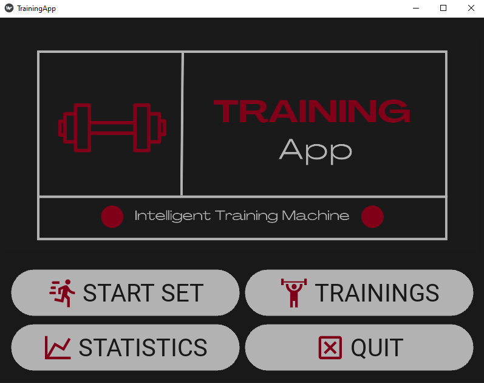
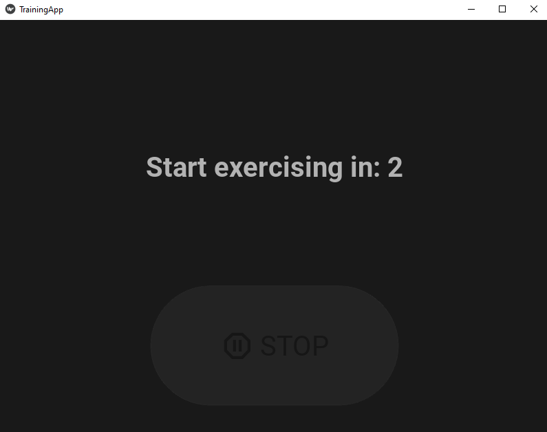
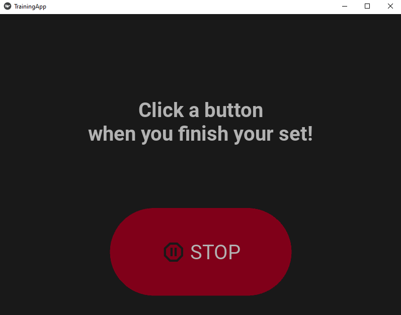
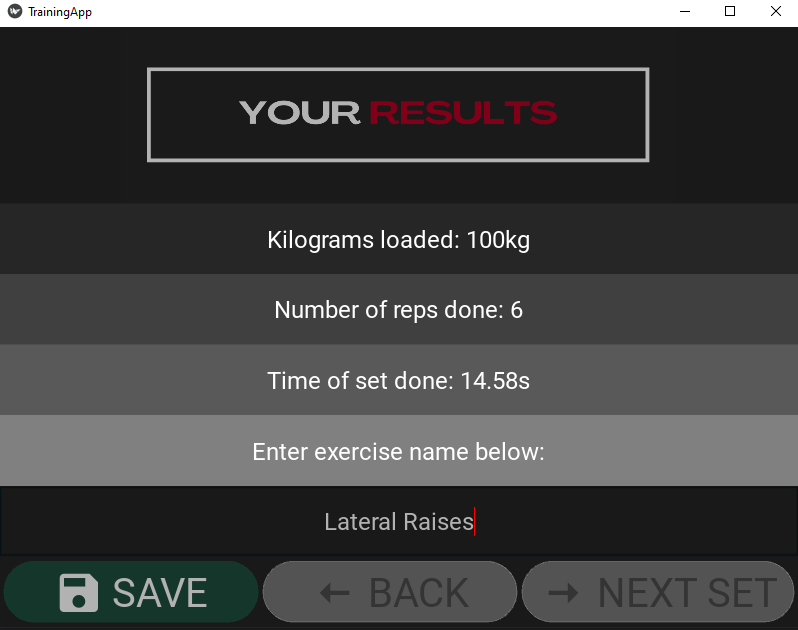
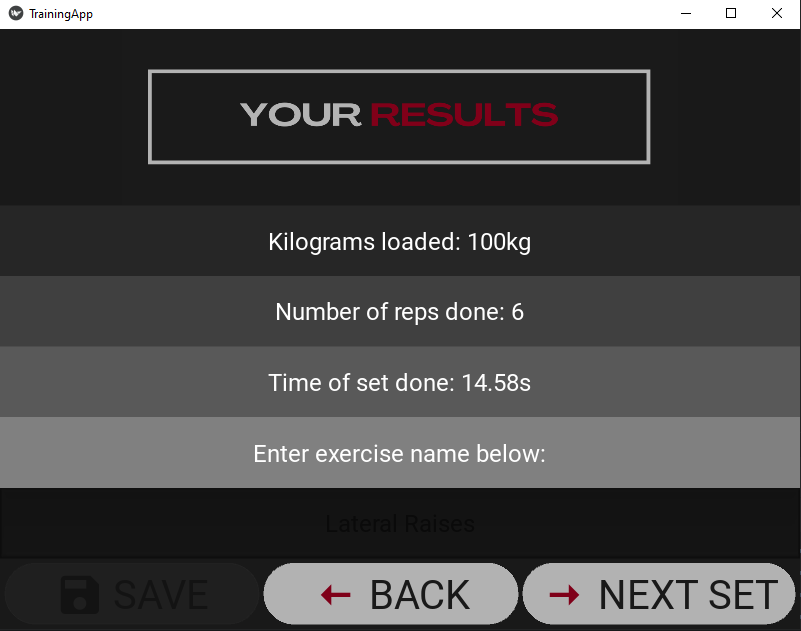
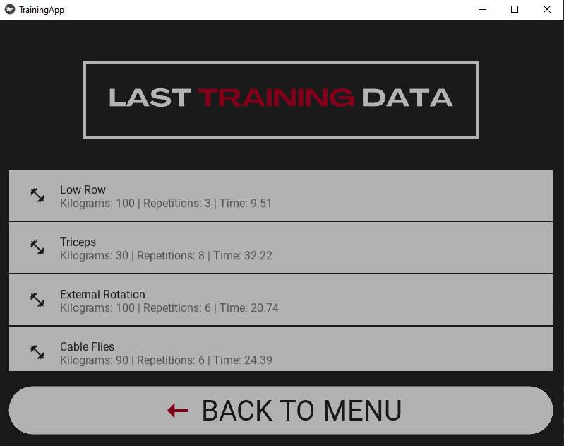
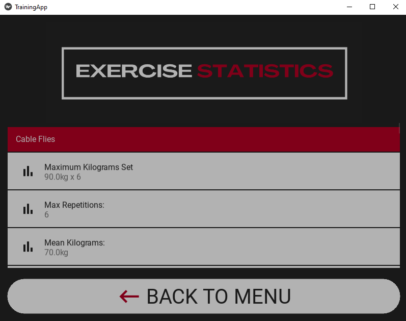

# Training App
Application designed in Python and C++ for registering and analyzing of the training session using an ultrasonic sensor.

The main intention of the project was to create a mobile application that would record data using an ultrasonic sensor mounted on the training machine.
Subsequently, it would analyze the gathered information, providing a report on the number of correctly performed repetitions, the weight set by the user, and the duration of the series.
Simultaneously, the project aimed to deliver an intuitive and understandable mobile application to the user, eliminating potential technological barriers.

by [@ericczop](https://github.com/ericczop)

## Screenshots:
Main menu view:

Countdown screen after clicking START buttton:

Result screen after data processing:

After clicking save button:

Information about particular training sets in TRAININGS:

Exercise statistics in STATISTICS section:

